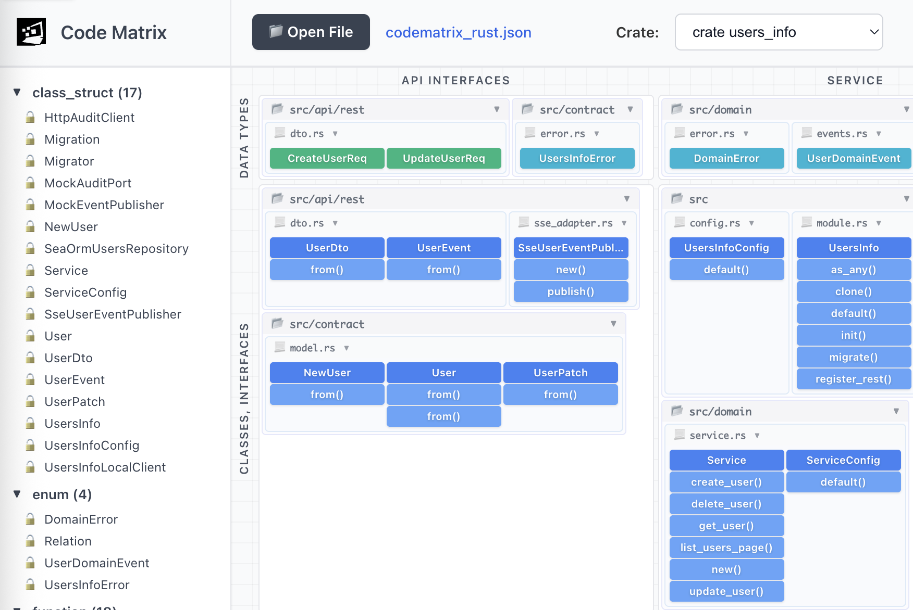

# CodeMatrix Visualizer

A modern visualization tool for exploring microservices code structure and relationships through interactive diagrams. CodeMatrix helps developers understand complex codebases by visualizing code entities, their relationships, and hierarchical organization.



## Overall Idea

The main idea of CodeMatrix is to represent all your microservice code as code `nodes` and place them into a 2D grid (matrix).
Each node represents a typical code element, such as `struct`, `class`, `function`, `class method`, `global variable`, `enum` and so on. The grid position of a node is determined by:
- the **vertical layer** (API, Service, Repository, Gateways)
- the **horizontal type** (data structures, classes, functions, tests)

CodeMatrix uses the following layers as **columns**:
- **API interface**: incoming HTTP routes, handlers and request/response data structures
- **Service**: core business logic and domain models
- **Repository**: database access, query helpers and migrations
- **Gateways**: HTTP/GRPC clients, message bus publishers, external API SDK wrappers

CodeMatrix uses the following code element types as **rows**:
- **Data structures**: DTOs, enums, configuration and global constants
- **Classes and interfaces**: domain services, repositories, client interfaces, traits
- **Free functions**: stateless helpers and pure functions
- **Unit tests**: test cases and fixtures

When the code is visualized, every code element is placed into the appropriate cell in this matrix. This layout lets you scan a microservice quickly, see where responsibilities live, and follow relationships between elements.

### Example: User Service Microservice

Imagine a simple `user-service` with:
- `GET /users/{id}` HTTP endpoint
- `UserService` containing business logic
- `UserRepository` that talks to the database
- `EmailClient` that sends welcome emails

These elements would map into the CodeMatrix like this (columns are layers, rows are code element types):

| Type \\ Layer       | API interface                                            | Service                                      | Repository                                      | Gateways                                  |
|---------------------|----------------------------------------------------------|----------------------------------------------|-------------------------------------------------|-------------------------------------------|
| Data structures     | `GetUserRequest`, `GetUserResponse`                      | `User`, `NewUser`, `UserStatus`              | `UserRow`, `UserFilter`, `DbConfig`             | `EmailMessage`, `EmailConfig`            |
| Classes/interfaces  | `UserHttpController`                                     | `UserService`                                | `UserRepository`, `UserRepositoryPostgres`      | `EmailClient`, `EmailClientHttp`         |
| Free functions      | `map_user_to_response(user)`                             | `hash_password(raw_password)`                | `build_user_query(filter)`                      | `build_welcome_email(user)`              |
| Unit tests          | `get_user_handler_tests.rs`                              | `user_service_tests.rs`                      | `user_repository_tests.rs`                      | `email_client_tests.rs`                  |

In a CodeMatrix JSON file, each of the names above would correspond to a node (`type`, `name`, `filename`, etc.), and the relationships between them (for example API handler calling `UserService`, `UserService` calling `UserRepository`, `UserService` calling `EmailClient`) would be expressed as edges.


## Quick Start

### Prerequisites

- Node.js 18+ and npm

### Installation & Running

```bash
# Install dependencies for both the package and app
npm install

# Alternatively, just apply the predefined testedependencies
npm ci

# Start the development server
npm run dev
```

The application will require you to open your favorite browser at `http://localhost:3000`.

## Working with CodeMatrix JSON Files

CodeMatrix visualizes code structure from **CodeMatrix JSON files** - a standardized format that describes code entities (functions, classes, structs, etc.) and their relationships.

### Generating CodeMatrix JSON Files

You need to generate CodeMatrix JSON files using a language-specific tool that analyzes your codebase. For example:

- **Rust**: Use [codematrix-rust](https://github.com/hypernetix/codematrix-rust) to analyze Rust projects
- **Other languages**: Language-specific CodeMatrix generators (coming soon)

### CodeMatrix JSON Format

**TODO**: Detailed JSON format specification will be documented here.

The basic structure includes:

```json
{
  "codematrix_json_version": "0.1",
  "nodes": [
    {
      "id": "unique-identifier",
      "type": "struct|enum|function|class|method|...",
      "name": "EntityName",
      "public": true,
      "filename": "path/to/file.rs",
      "start_line": 10,
      "end_line": 20,
      "source_code": "...",
      "description": "...",
      "details": {}
    }
  ],
  "edges": [
    {
      "from": "node-id-1",
      "to": "node-id-2",
      "type": "calls|reference|includes|..."
    }
  ]
}
```

## Project Structure

```
codematrix/
├── packages/
│   └── code-matrix-visualizer/          # Redistributable package
│       ├── src/
│       │   ├── components/              # React components
│       │   ├── parser.ts                # CodeMatrix data parser
│       │   ├── types.ts                 # TypeScript types
│       │   ├── styles.css               # Component styles
│       │   └── index.tsx                # Package entry point
│       ├── package.json
│       └── README.md
├── app/                                 # Demo application
│   ├── src/
│   │   ├── App.tsx                      # Main app component
│   │   ├── main.tsx                     # Entry point
│   │   └── index.css                    # Global styles
│   ├── public/
│   │   └── code_matrix.svg              # CodeMatrix logo
│   ├── index.html
│   ├── vite.config.ts
│   └── package.json
├── examples/                            # Example CodeMatrix JSON files
└── README.md
```

## Features

### 1. Left Menu (Code element nodes tree)
- Hierarchical view of all discovered code element nodes
- Grouped by node type (crate, struct, enum, function, class, method, etc.)
- Alphabetically sorted within groups
- Collapsible groups and menu
- Visual indicators for public/private nodes
- Node selection and highlighting

### 2. Main Content Area

#### Sticky Toolbar Header
- **Open File**: Load CodeMatrix JSON files dynamically
- **Code package Selector**: Switch between different packages/crates/modules
- **Focus Search**: Real-time search across all nodes
- **View Mode Selector**:
  - Relationship (default) - Shows connections between nodes
  - Code Size Map - shows heatmap based on code element size (LOC)
  - TODO: Heatmap - Color-coded visualization by node type
  - TODO: Code Coverage - Coverage analysis view

#### Scrollable Main Panel
- **Custom HTML/CSS diagram** (no external dependencies!)
- **Hierarchical folder/file grouping** with visual containers
- **Collapsible folders and files** - click headers to toggle
- **Zoom and pan controls** - Shift+scroll to zoom, drag to pan
- **Node interactions**:
  - Single click to select
  - Double click to toggle selection
  - Cmd/Ctrl + hover to preview source code
  - Cmd/Ctrl + click to pin source code preview
- **Edge rendering** with SVG arrows showing relationships
- **Focus mode** with relationship highlighting
- **Search** by code element name

#### Sticky Footer Bar
- Real-time statistics for each node type
- Total node count
- Breakdown by category
- Interactive hints and settings


## Features Roadmap

- [x] ~~ReactFlow replacement~~ - Custom HTML/CSS rendering
- [x] ~~Hierarchical folder/file grouping~~
- [x] ~~Collapsible groups~~
- [x] ~~Node details popup~~
- [x] ~~Dynamic file loading~~
- [x] ~~Filter self-referencing calls~~
- [ ] Code Matrix json specification and tests for different languages
- [ ] HeatMap by code element criticality
- [ ] Code coverage map
- [ ] Export diagram as image/PDF
- [ ] Smart edge routing
- [ ] Custom node styling
- [ ] Advanced filtering options
- [ ] Language-specific generators for Go, Python, TypeScript, Java, etc.

## Related Projects

- [codematrix-rust](https://github.com/hypernetix/codematrix-rust) - Rust code analyzer that generates CodeMatrix JSON files

## License

APACHE 2.0
